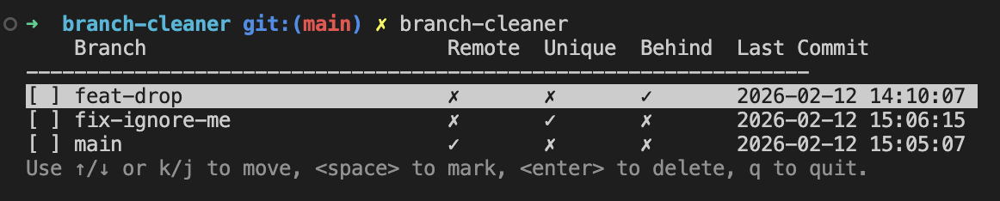

# branch-cleaner

A simple CLI tool to remove local git branches that are no longer present on the remote.



## Installation

Install using Go:

```sh
go install github.com/StevenCyb/branch-cleaner@latest
# Add this to ~/.zshrc or other shell config file:
export PATH=$PATH:$HOME/go/bin
# Then reload your shell:
source ~/.zshrc
```

## Usage

Run in the current directory:

```sh
branch-cleaner
```

Or specify a path to a git repository:

```sh
branch-cleaner /path/to/repo
```

## Features

- Lists local branches not present on remote
- Shows branch name, dirty flag, and last commit time in a table
- Use arrow up/down to select branches
- Press <space> to mark/unmark branches for deletion
- Press <enter> to delete marked branches and exit
- If no branches to delete, prints a message and exits

## Disclaimer

Use with caution. This tool will permanently delete local branches. Always review the list of branches before confirming deletion. Consider backing up your repository before using this tool. The author is not responsible for any data loss or issues caused by using this tool.
